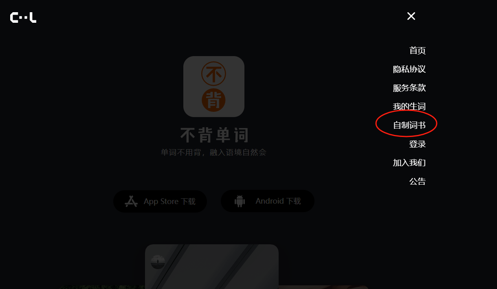

# IELTS-listening-tool

## 雅思学习的小工具

在学习雅思语料库时，总是觉得听写起来很麻烦，需要随时暂停音频，在总结错题时也非常繁琐。更麻烦的是，这个语料库中的很多单词我也不认识。因此，我在B站找到了一个UP主开发的专门用于练习听力的网站：[idictation.cn](https://idictation.cn)。相关B站视频链接：[雅思王陆语料库 自动校正、自动计算正确率的EXCEL表格-智慧语料库](https://www.bilibili.com/video/BV1654y1R7th/?share_source=copy_web&vd_source=11d77982a9dea884298450f4a3a0bcfd)。

在使用过程中，我逐渐摸索出了一个高效的方法：

1. **使用网站练习听力**：先用网站练习听力，然后下载错误的单词（网站提供下载Excel文件的功能）。
2. **提取单词生成txt文件**：将Excel文件中的单词提取出来，生成一个txt文件。
3. **上传到“不背单词”**：将生成的txt文件上传到“不背单词”自制词书，并用手机记忆这些单词。

本文件包含了一个小型Python脚本，能够将下载的Excel文件中的单词转换为“不背单词”可以识别的txt格式文档。

这种方法使得使用语料库更加高效。祝大家雅思高分通过！

